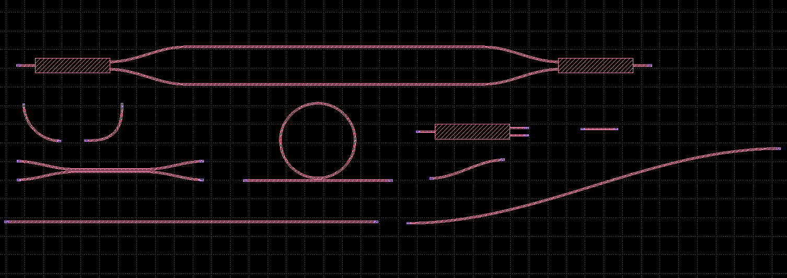

# KLayout Silicon Photonics PDK

[日本語](README.md)

An open-source Silicon Photonics PCell library and interactive waveguide
router for **KLayout 0.30.9**.

> **Development status:** Early development / geometry prototype\
> This project is currently not a foundry-qualified Silicon Photonics
> PDK.

## Overview

This project uses KLayout PCells (Parameterized Cells) to generate basic
Silicon Photonics devices and develops an interactive **Photonics
Router** for connecting optical ports between PCells.

## Supported Environment

-   KLayout `0.30.9`
-   KLayout Python API
-   Linux

# PCell Library v4

Registered library name: `Photonics`

  PCell                  Function
  ---------------------- -----------------------------------
  `Straight`             Straight waveguide
  `Bend90`               90-degree bend
  `EulerBend`            Euler-type bend
  `SBend`                S-bend
  `Ring`                 Ring resonator
  `DirectionalCoupler`   Directional coupler
  `MMI_1x2`              1x2 MMI
  `MZI`                  Mach-Zehnder Interferometer
  `WaveguideRoute`       Bézier-curve waveguide
  `PortConnector`        Optical port connection waveguide

## PCell Library v4 Example

Example layout generated with PCell Library v4 on KLayout 0.30.9. The
image shows representative geometries including straight waveguides,
bends, a ring, directional coupler, MMI, MZI, and S-bend structures.



# Layer Definition

  Purpose         Layer / Datatype
  ------------- ------------------
  Waveguide                  `1/0`
  Optical Pin                `2/0`

# Photonics Router

## Router Development History

  -----------------------------------------------------------------------
  Version                 Function                Status
  ----------------------- ----------------------- -----------------------
  v5.1                    Two-click waveguide     ✅ Verified on KLayout
                          generation              0.30.9

  v5.2                    Automatic snapping to   ✅ Verified on KLayout
                          optical ports           0.30.9

  v5.3                    Port-direction          API compatibility issue
                          detection               

  v5.3.1                  `each_point()` support  Revision continued

  v5.3.2                  Port position +         ✅ Verified on KLayout
                          direction-aware routing 0.30.9

  **v5.4**                **Loop suppression +    **✅ Verified on
                          automatic route-shape   KLayout 0.30.9**
                          adjustment**            
  -----------------------------------------------------------------------

## Router v5.4

**Photonics Router v5.4 has been verified on KLayout 0.30.9.**

v5.4 retains the port-position and direction detection introduced in
v5.3.2 while improving cases where a Bézier route could make an
unnecessary detour or loop.

Main improvements:

-   Automatic snapping to optical ports
-   Port-direction detection from Pin Paths
-   Automatic control-distance scaling based on port spacing
-   Direction selection based on relative port positions
-   Detection of excessive detours and reversals
-   Midpoint fallback routing when required
-   Smooth tangential connections at source and destination ports
-   Waveguide generation on Layer `1/0`

## Photonics Router v5.4 Examples

Examples verified on KLayout 0.30.9.

### Before routing

The optical ports are not yet connected.


### After routing

Photonics Router v5.4 detects the optical port positions and directions
and creates smooth connections without the unwanted loop.


> **Note:** v5.4 is an experimental geometry-based router. Strict
> minimum bend-radius guarantees, obstacle avoidance, DRC-aware routing,
> and optical path-length matching remain future work.

# Router v5.4 Parameters

  Parameter             Value Description
  --------------- ----------- -------------------------------
  `WG_WIDTH`         `0.5 µm` Waveguide width
  `SNAP_RADIUS`      `4.0 µm` Optical port search radius
  `MIN_LEAD`         `4.0 µm` Minimum control distance
  `MAX_LEAD`        `20.0 µm` Maximum control distance
  `NPTS`                 `96` Number of Bézier curve points
  `WG_LAYER`            `1/0` Waveguide layer
  `PIN_LAYER`           `2/0` Optical pin layer

# Installation

``` text
~/.klayout/pymacros/
├── photonics_pdk_v4.lym
└── photonics_router_v5_4.lym
```

# Repository Structure

``` text
klayout-photonics-pdk/
├── README.md
├── README_en.md
├── LICENSE
├── images/
│   ├── router_v5_4_connected.png
│   └── router_v5_4_segments.png
├── pymacros/
│   ├── photonics_pdk_v4.lym
│   ├── photonics_router_v5_3_2.lym
│   └── photonics_router_v5_4.lym
├── docs/
├── examples/
└── tests/
```

# Development Roadmap

## v5.5

-   Minimum-bend-radius-aware routing
-   Euler / Arc-based routing
-   More natural optical port connections

## v6

-   Obstacle avoidance
-   DRC-aware routing
-   Port width/layer inheritance
-   Automatic taper insertion

# License

MIT License

``` text
Copyright (c) 2026 TAKE-HooJoo@SIG
```

# Disclaimer

This software is provided **AS IS**. The current PCell dimensions,
device geometries, and routing geometries do not guarantee
manufacturability, optical performance, or reliability for any specific
Silicon Photonics fabrication process.

# Author

**TAKE-HooJoo@SIG**

Open-Source Silicon Photonics PDK / KLayout PCell Development
