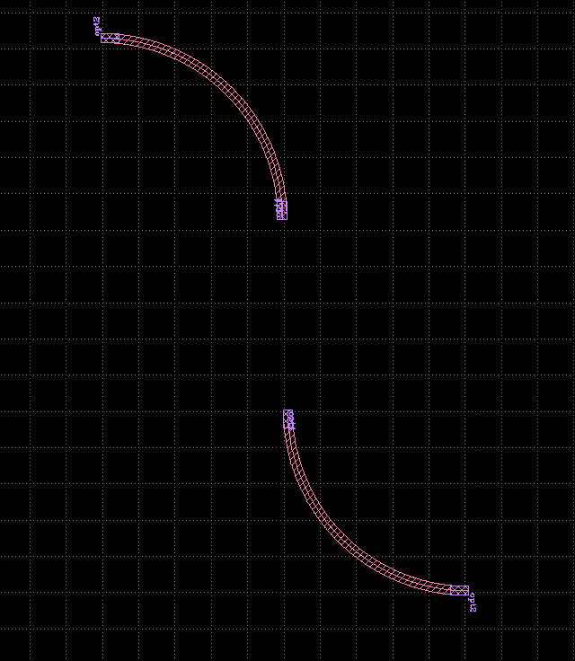
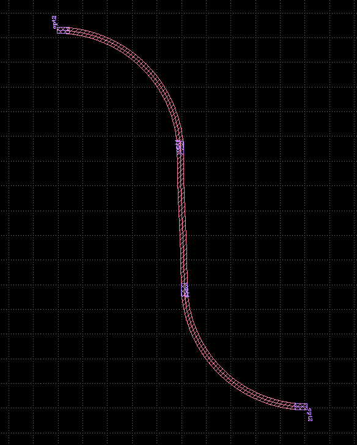
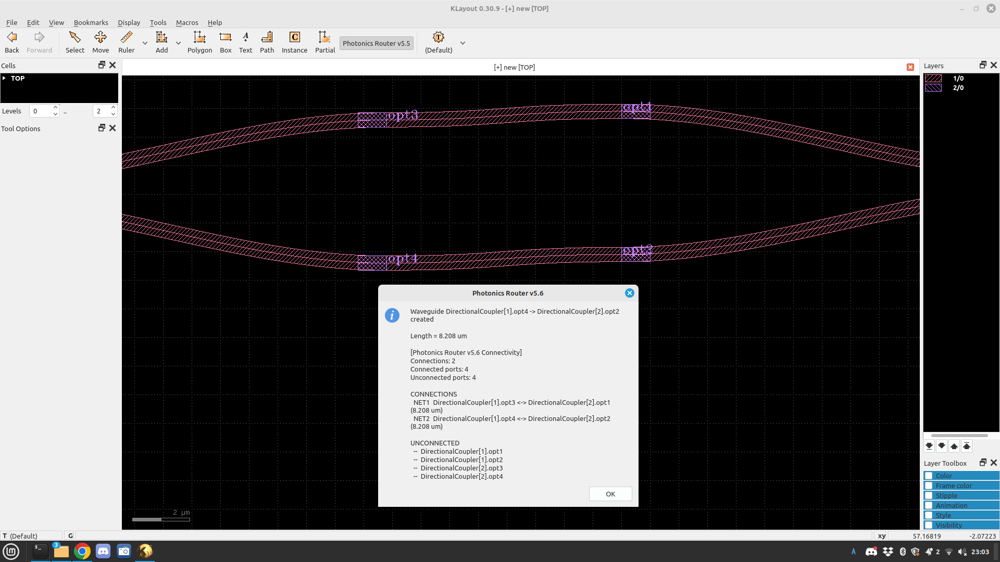
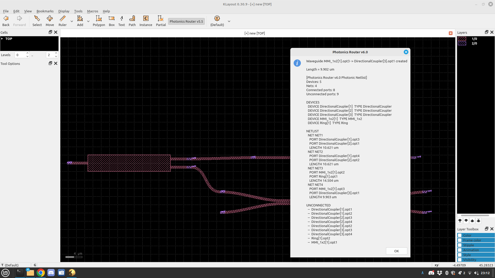
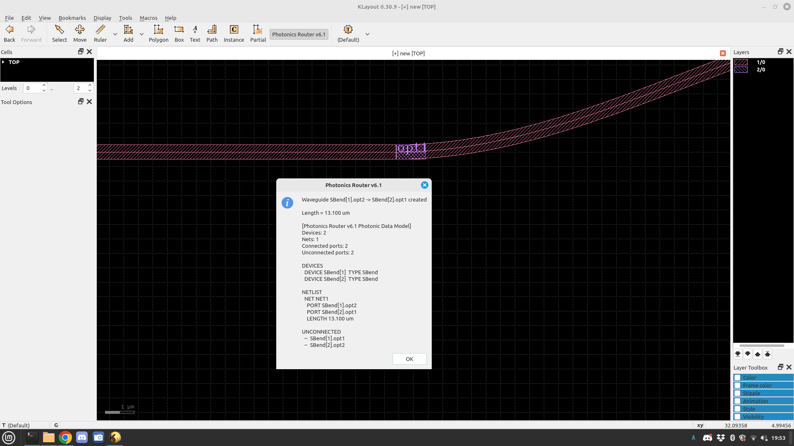

# KLayout Silicon Photonics PDK

[日本語](README.md)

An open-source Silicon Photonics PCell library and interactive waveguide router
for **KLayout 0.30.9**.

> **Development status:** Early development / geometry prototype
> This project is not currently a foundry-qualified Silicon Photonics PDK.

## Overview

This project uses KLayout's PCell (Parameterized Cell) framework to generate
basic parametric devices for Silicon Photonics. It also includes a
**Photonics Router** for interactively connecting optical ports defined by PCells.

Router v6.1 inherits the v6.0 Photonic Netlist Extraction flow and introduces
an explicit data model based on `PhotonicDevice`, `OpticalPort`, and `PhotonicNet`.
It recognizes PCell port names, instances, connectivity, and waveguide lengths,
and can extract a basic photonic netlist from the layout.

## Supported Environment

- KLayout `0.30.9`
- KLayout Python API
- Linux

# PCell Library v4

Registered library name: `Photonics`

| PCell | Function |
|---|---|
| `Straight` | Straight waveguide |
| `Bend90` | 90-degree bend |
| `EulerBend` | Euler-type bend |
| `SBend` | S-bend |
| `Ring` | Ring resonator |
| `DirectionalCoupler` | Directional coupler |
| `MMI_1x2` | 1x2 MMI |
| `MZI` | Mach-Zehnder Interferometer |
| `WaveguideRoute` | Bézier-curve waveguide |
| `PortConnector` | Waveguide for optical-port connection |


# Layer Definition

| Purpose | Layer / Datatype |
|---|---|
| Waveguide | `1/0` |
| Optical Pin | `2/0` |

# Photonics Router

Basic operation:

```text
Click source port
       ↓
Click destination port
       ↓
Generate waveguide automatically
       ↓
Extract connectivity and path length
```

## Router Development History

| Version | Main feature | Status |
|---|---|---|
| v5.1 | Two-click waveguide generation | ✅ Verified on KLayout 0.30.9 |
| v5.2 | Automatic snapping to optical ports | ✅ Verified on KLayout 0.30.9 |
| v5.3 | Port direction recognition | API compatibility issue |
| v5.3.1 | `each_point()` support | Fixed version |
| v5.3.2 | Port position + direction recognition | ✅ Verified on KLayout 0.30.9 |
| v5.4 | Loop suppression + automatic route adjustment | ✅ Verified on KLayout 0.30.9 |
| v5.5 | Port metadata + waveguide length | ✅ Verified on KLayout 0.30.9 |
| v5.6 | Connectivity verification | ✅ Verified on KLayout 0.30.9 |
| v6.0 | Photonic Netlist Extraction | ✅ Verified on KLayout 0.30.9 |
| **v6.1** | **Photonic Data Model** | **✅ Verified on KLayout 0.30.9** |

## Router v5.4

v5.4 improves unwanted large detours and loop-like Bézier routes while
retaining port-position and direction recognition.





## Router v5.5

Connected ports: 4
Unconnected ports: 4
```



# Photonics Router v6.0

**Photonics Router v6.0 has been verified on KLayout 0.30.9.**

v6.0 analyzes PCells, native ports, instances, and routed waveguides in the
layout and generates a basic photonic netlist.

Main features:

- Device recognition
- Instance identification
- Native PCell port-name recognition
- Connection extraction
- `PhotonicNet` objects
- Connected / unconnected port detection
- Waveguide length for each net
- Photonic netlist display

Example:

```text
DEVICES
  DEVICE DirectionalCoupler[1] TYPE DirectionalCoupler
  DEVICE MMI_1x2[1] TYPE MMI_1x2
  DEVICE Ring[1] TYPE Ring

NETLIST
  NET NET1
    PORT DirectionalCoupler[1].opt3
    PORT DirectionalCoupler[2].opt1
    LENGTH 10.621 um

  NET NET3
    PORT MMI_1x2[1].opt2
    PORT Ring[1].opt1
    LENGTH 14.504 um
```

Extraction has been verified across heterogeneous PCells including
DirectionalCoupler, MMI, and Ring devices.



## v6.0 Data Flow

```text
Layout
  ↓
Device Recognition
  ↓
Native PCell Port Recognition
  ↓
Instance Identification
  ↓
Connection Extraction
  ↓
PhotonicNet
  ↓
Photonic Netlist
```

# Photonics Router v6.1 — Photonic Data Model

**Photonics Router v6.1 has been verified on KLayout 0.30.9.**

v6.1 preserves the v6.0 routing behavior and Photonic Netlist Extraction
while introducing an explicit internal data model for photonic circuits.

```text
PhotonicDevice
      |
      +-- OpticalPort
               |
               +-- PhotonicNet
```

Main additions:

- Added `PhotonicDevice`
- Added explicit `PhotonicDevice <-> OpticalPort` relationships
- Added explicit `OpticalPort <-> PhotonicNet` relationships
- Preserved native PCell port metadata
- Preserved photonic netlist extraction
- Preserved waveguide-length extraction
- Preserved the v6.0 two-click interactive routing behavior

Verified example:

```text
DEVICES
  DEVICE SBend[1] TYPE SBend
  DEVICE SBend[2] TYPE SBend

NETLIST
  NET NET1
    PORT SBend[1].opt2
    PORT SBend[2].opt1
    LENGTH 13.100 um

UNCONNECTED
  -- SBend[1].opt1
  -- SBend[2].opt2
```

This data model provides the foundation for the v6.2 Bend-aware Router,
Photonic Verification, and Netlist Export.



# Router Basic Parameters

| Parameter | Value | Description |
|---|---:|---|
| `WG_WIDTH` | `0.5 µm` | Waveguide width |
| `SNAP_RADIUS` | `4.0 µm` | Optical-port search radius |
| `MIN_LEAD` | `4.0 µm` | Minimum control distance |
| `MAX_LEAD` | `20.0 µm` | Maximum control distance |
| `NPTS` | `96` | Number of Bézier sampling points |
| `WG_LAYER` | `1/0` | Waveguide layer |
| `PIN_LAYER` | `2/0` | Optical-port layer |

# Installation

```text
~/.klayout/pymacros/
├── photonics_pdk_v4.lym
└── photonics_router_v6_1.lym
```

To avoid duplicate Router registration, move unused older versions outside
the `pymacros` directory and completely restart KLayout.

# Repository Structure

```text
klayout-photonics-pdk/
├── README.md
├── README_en.md
├── LICENSE
├── images/
│   ├── router_v5_4_connected.png
│   ├── router_v5_4_segments.png
│   ├── router_v5_5_length_curved.png
│   ├── router_v5_5_length_straight.png
│   ├── router_v5_5_1_native_ports.png
│   ├── router_v5_5_2_instance_ports.png
│   ├── router_v5_6_connectivity.png
│   ├── router_v5_6_two_nets.png
│   ├── router_v6_0_netlist.png
│   └── router_v6_1_photonic_data_model.png
├── pymacros/
│   ├── photonics_pdk_v4.lym
│   ├── photonics_router_v5_3_2.lym
│   ├── photonics_router_v5_4.lym
│   ├── photonics_router_v5_5.lym
│   ├── photonics_router_v5_6.lym
│   └── photonics_router_v6_1.lym
├── docs/
├── examples/
└── tests/
```

# Development Roadmap

## v6.0 — Photonic Netlist Extraction

- Device recognition
- Instance identification
- Native port recognition
- Connectivity extraction
- Photonic Netlist extraction

**Status: Completed (prototype)**

## v6.1 — Photonic Data Model

- `PhotonicDevice`
- `OpticalPort`
- `PhotonicNet`
- Device / Port / Net relationships

**Status: Completed — verified on KLayout 0.30.9**

## v6.2 — Bend-aware Router

- Minimum bend radius
- Curvature check
- Bézier route optimization

**Status: Next**

## v6.3 — Photonic Verification

- Unconnected port detection
- Port width mismatch detection
- Port orientation mismatch detection
- Bend-radius violation detection

## v6.4 — Netlist Export

- Photonic netlist file export

## v7.0 — Advanced Router

- Euler / Clothoid bends
- Waveguide types
- Advanced routing
