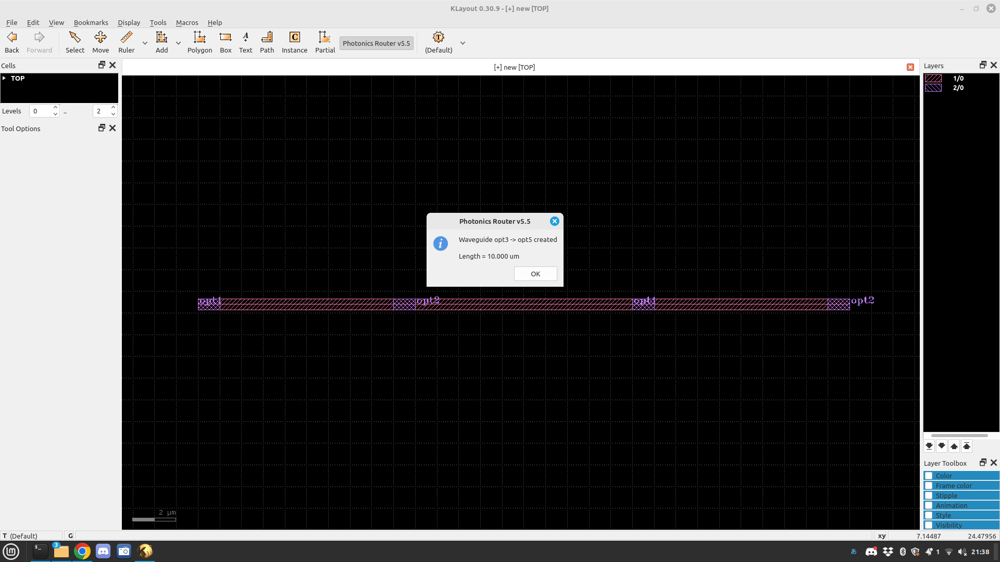
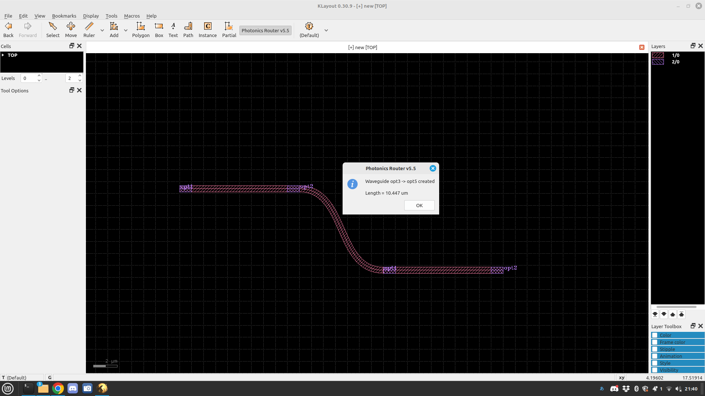
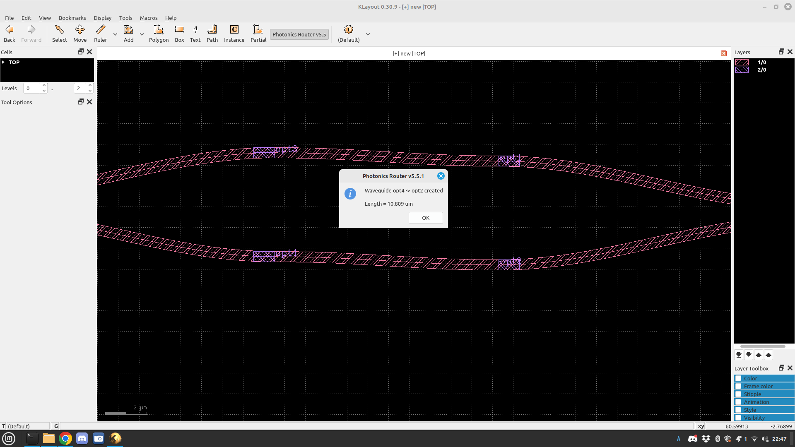
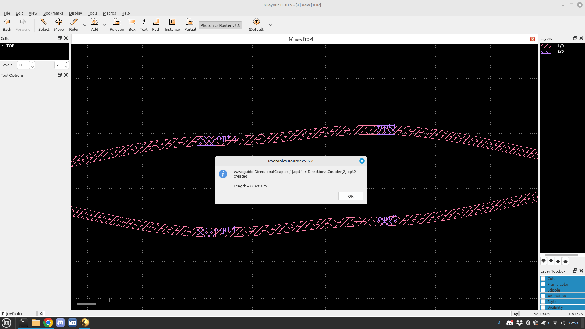
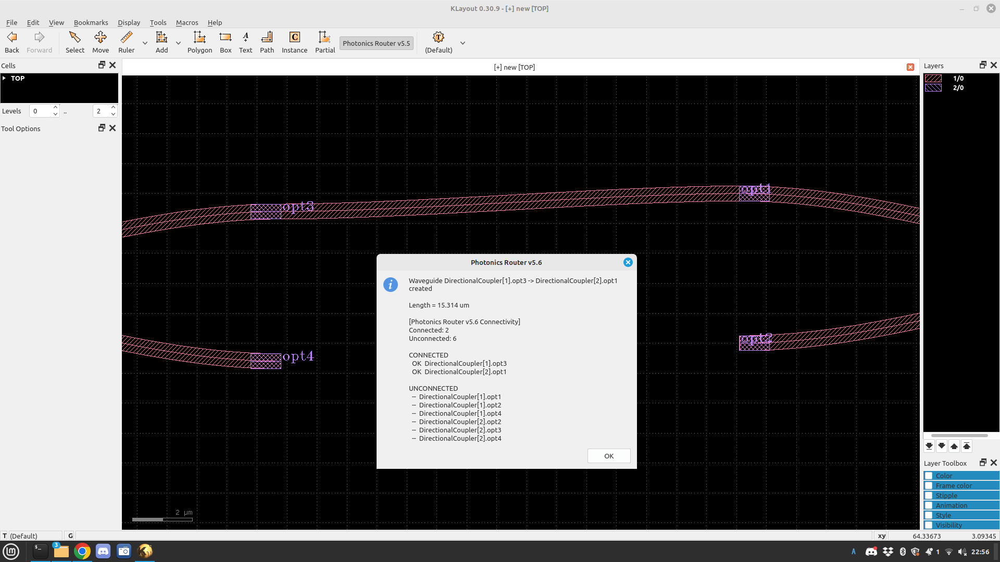

# KLayout Silicon Photonics PDK

[日本語](README.md)

An open-source Silicon Photonics PCell library and interactive waveguide router
for **KLayout 0.30.9**.

> **Development status:** Early development / geometry prototype
> This project is not currently a foundry-qualified Silicon Photonics PDK.

## Overview

This project uses KLayout's PCell (Parameterized Cell) framework to generate
basic parametric devices for Silicon Photonics. It also includes a
**Photonics Router** for interactively connecting optical ports defined by PCells.

Router v6.0 can recognize PCell port names, instances, connectivity, and
waveguide lengths, and can extract a basic photonic netlist from the layout.

## Supported Environment

- KLayout `0.30.9`
- KLayout Python API
- Linux

# PCell Library v4

Registered library name: `Photonics`

| PCell | Function |
|---|---|
| `Straight` | Straight waveguide |
| `Bend90` | 90-degree bend |
| `EulerBend` | Euler-type bend |
| `SBend` | S-bend |
| `Ring` | Ring resonator |
| `DirectionalCoupler` | Directional coupler |
| `MMI_1x2` | 1x2 MMI |
| `MZI` | Mach-Zehnder Interferometer |
| `WaveguideRoute` | Bézier-curve waveguide |
| `PortConnector` | Waveguide for optical-port connection |


# Layer Definition

| Purpose | Layer / Datatype |
|---|---|
| Waveguide | `1/0` |
| Optical Pin | `2/0` |

# Photonics Router

Basic operation:

```text
Click source port
       ↓
Click destination port
       ↓
Generate waveguide automatically
       ↓
Extract connectivity and path length
```

## Router Development History

| Version | Main feature | Status |
|---|---|---|
| v5.1 | Two-click waveguide generation | ✅ Verified on KLayout 0.30.9 |
| v5.2 | Automatic snapping to optical ports | ✅ Verified on KLayout 0.30.9 |
| v5.3 | Port direction recognition | API compatibility issue |
| v5.3.1 | `each_point()` support | Fixed version |
| v5.3.2 | Port position + direction recognition | ✅ Verified on KLayout 0.30.9 |
| v5.4 | Loop suppression + automatic route adjustment | ✅ Verified on KLayout 0.30.9 |
| v5.5 | Port metadata + waveguide length | ✅ Verified on KLayout 0.30.9 |
| v5.6 | Connectivity verification | ✅ Verified on KLayout 0.30.9 |
| **v6.0** | **Photonic Netlist Extraction** | **✅ Verified on KLayout 0.30.9** |

## Router v5.4

v5.4 improves unwanted large detours and loop-like Bézier routes while
retaining port-position and direction recognition.


## Router v5.5

v5.5 introduces `OpticalPort` metadata and waveguide-length calculation.

Main features:

- Port name / position / direction / width metadata
- Bézier waveguide path-length calculation
- Length output in micrometers
- Routing-completion dialog
- Python Console output

### Waveguide Length Verification

Straight waveguide:

```text
Waveguide opt3 -> opt5 created
Length = 10.000 um
```



Curved waveguide:

```text
Waveguide opt3 -> opt5 created
Length = 10.447 um
```



### Native Port Name / Instance Identification

During development, the router was extended to recognize native PCell port
names such as `opt1` and `opt2`, and to identify the owning instance.





## Router v5.6 — Connectivity Verification

v5.6 scans the layout and classifies optical ports as connected or unconnected.

```text
Connected: 2
Unconnected: 6
```



Multiple connection extraction was also verified during development.

```text
Connections: 2
Connected ports: 4
Unconnected ports: 4
```


# Photonics Router v6.0

**Photonics Router v6.0 has been verified on KLayout 0.30.9.**

v6.0 analyzes PCells, native ports, instances, and routed waveguides in the
layout and generates a basic photonic netlist.

Main features:

- Device recognition
- Instance identification
- Native PCell port-name recognition
- Connection extraction
- `PhotonicNet` objects
- Connected / unconnected port detection
- Waveguide length for each net
- Photonic netlist display

Example:

```text
DEVICES
  DEVICE DirectionalCoupler[1] TYPE DirectionalCoupler
  DEVICE MMI_1x2[1] TYPE MMI_1x2
  DEVICE Ring[1] TYPE Ring

NETLIST
  NET NET1
    PORT DirectionalCoupler[1].opt3
    PORT DirectionalCoupler[2].opt1
    LENGTH 10.621 um

  NET NET3
    PORT MMI_1x2[1].opt2
    PORT Ring[1].opt1
    LENGTH 14.504 um
```

Extraction has been verified across heterogeneous PCells including
DirectionalCoupler, MMI, and Ring devices.


## v6.0 Data Flow

```text
Layout
  ↓
Device Recognition
  ↓
Native PCell Port Recognition
  ↓
Instance Identification
  ↓
Connection Extraction
  ↓
PhotonicNet
  ↓
Photonic Netlist
```

# Router Basic Parameters

| Parameter | Value | Description |
|---|---:|---|
| `WG_WIDTH` | `0.5 µm` | Waveguide width |
| `SNAP_RADIUS` | `4.0 µm` | Optical-port search radius |
| `MIN_LEAD` | `4.0 µm` | Minimum control distance |
| `MAX_LEAD` | `20.0 µm` | Maximum control distance |
| `NPTS` | `96` | Number of Bézier sampling points |
| `WG_LAYER` | `1/0` | Waveguide layer |
| `PIN_LAYER` | `2/0` | Optical-port layer |

# Installation

```text
~/.klayout/pymacros/
├── photonics_pdk_v4.lym
└── photonics_router_v6_0.lym
```

To avoid duplicate Router registration, move unused older versions outside
the `pymacros` directory and completely restart KLayout.

# Repository Structure

```text
klayout-photonics-pdk/
├── README.md
├── README_en.md
├── LICENSE
├── images/
│   ├── router_v5_4_connected.png
│   ├── router_v5_4_segments.png
│   ├── router_v5_5_length_curved.png
│   ├── router_v5_5_length_straight.png
│   ├── router_v5_5_1_native_ports.png
│   ├── router_v5_5_2_instance_ports.png
│   ├── router_v5_6_connectivity.png
│   ├── router_v5_6_two_nets.png
│   └── router_v6_0_netlist.png
├── pymacros/
│   ├── photonics_pdk_v4.lym
│   ├── photonics_router_v5_3_2.lym
│   ├── photonics_router_v5_4.lym
│   ├── photonics_router_v5_5.lym
│   ├── photonics_router_v5_6.lym
│   └── photonics_router_v6_0.lym
├── docs/
├── examples/
└── tests/
```

# Development Roadmap

## v6.0

- Device recognition
- Instance identification
- Native port recognition
- Connectivity extraction
- Photonic Netlist extraction

**Status: Completed (prototype)**

## Next

- Port width mismatch detection
- Port orientation mismatch detection
- Netlist file export
- Minimum-bend-radius-aware routing
- Euler / Arc-based routing
- Obstacle avoidance
- DRC-aware routing
- Automatic taper insertion
- Optical path-length matching

# License

MIT License

```text
Copyright (c) 2026 TAKE-HooJoo@SIG
```

# Disclaimer

This software is provided AS IS. The current PCell dimensions, device
geometries, routing geometries, and extracted photonic netlists do not
guarantee manufacturability, optical performance, or reliability for any
specific Silicon Photonics fabrication process.

# Author

**TAKE-HooJoo@SIG**

Open-Source Silicon Photonics PDK / KLayout PCell Development
